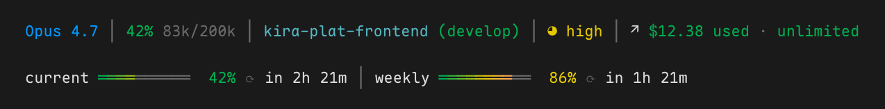

# claude-statusline

A portable Claude Code status-line bundle with live context usage, subscription
rate bars, worktree-aware paths, effort indicators, and custom subagent rows.

The bundle is pure Bash and uses `jq`, `curl`, and `git`. It is maintained
as a publication subset of a private chezmoi dotfiles source; this repository
contains only the files needed to install, run, test, and document the shared
status lines.



## Components

- `statusline.sh` renders the main Claude Code status line.
- `subagent-statusline.sh` renders one custom row per subagent.
- `lib/statusline-cache.sh` performs non-blocking usage refresh, credential
  lookup, locking, and the context-usage handoff used by reminder hooks.

The render path only reads local state. Network refresh runs asynchronously, so
the prompt is never blocked by the Anthropic usage endpoint.

## Requirements

- Bash
- [jq](https://jqlang.github.io/jq/)
- [curl](https://curl.se/)
- Git

On macOS:

```bash
brew install jq
```

## Install

The installer downloads all three components, backs up an existing
`~/.claude/settings.json` when it needs to change it, and merges both
`statusLine` and `subagentStatusLine`.

```bash
curl -fsSL https://raw.githubusercontent.com/Gaotity/claude-statusline/main/install.sh | bash
```

Restart Claude Code after installation.

To uninstall:

```bash
curl -fsSL https://raw.githubusercontent.com/Gaotity/claude-statusline/main/uninstall.sh | bash
```

The uninstaller restores the original settings backup when available. Without a
backup, it removes only the two status-line keys and preserves unrelated
settings.

## Manual install

```bash
mkdir -p ~/.claude/lib
curl -fsSL https://raw.githubusercontent.com/Gaotity/claude-statusline/main/statusline.sh -o ~/.claude/statusline.sh
curl -fsSL https://raw.githubusercontent.com/Gaotity/claude-statusline/main/subagent-statusline.sh -o ~/.claude/subagent-statusline.sh
curl -fsSL https://raw.githubusercontent.com/Gaotity/claude-statusline/main/lib/statusline-cache.sh -o ~/.claude/lib/statusline-cache.sh
chmod +x ~/.claude/statusline.sh ~/.claude/subagent-statusline.sh
```

Add these settings to `~/.claude/settings.json`:

```json
{
  "statusLine": {
    "type": "command",
    "command": "bash \"$HOME/.claude/statusline.sh\"",
    "refreshInterval": 30
  },
  "subagentStatusLine": {
    "type": "command",
    "command": "bash \"$HOME/.claude/subagent-statusline.sh\""
  }
}
```

## Maintainer sync

The chezmoi source remains canonical. The maintainer command has an explicit
read-only check mode and an explicit write mode:

```bash
scripts/sync-from-chezmoi.sh --check
scripts/sync-from-chezmoi.sh --write
```

Use `--source <path>` to test against a fixture or an alternate chezmoi source.
The script reads only the three documented source files and never writes to the
source repository.

Run all repository checks before committing:

```bash
bash tests/sync-from-chezmoi.sh
bash tests/render.smoke.sh
bash tests/install-uninstall.sh
```

## Security

No OAuth token is stored in this repository. At runtime, the cache helper checks
`CLAUDE_CODE_OAUTH_TOKEN`, macOS Keychain, Claude Code's local credentials
file, or Linux Secret Service. Tokens are passed to `curl` through a header on
standard input and are never logged.

Credentials, sessions, transcripts, caches, and machine-specific configuration
are intentionally excluded.

## Credits

Inspired by
[kamranahmedse/claude-statusline](https://github.com/kamranahmedse/claude-statusline).

## License

[MIT](./LICENSE). Portions originally from `kamranahmedse/claude-statusline`
(MIT, © Kamran Ahmed).
